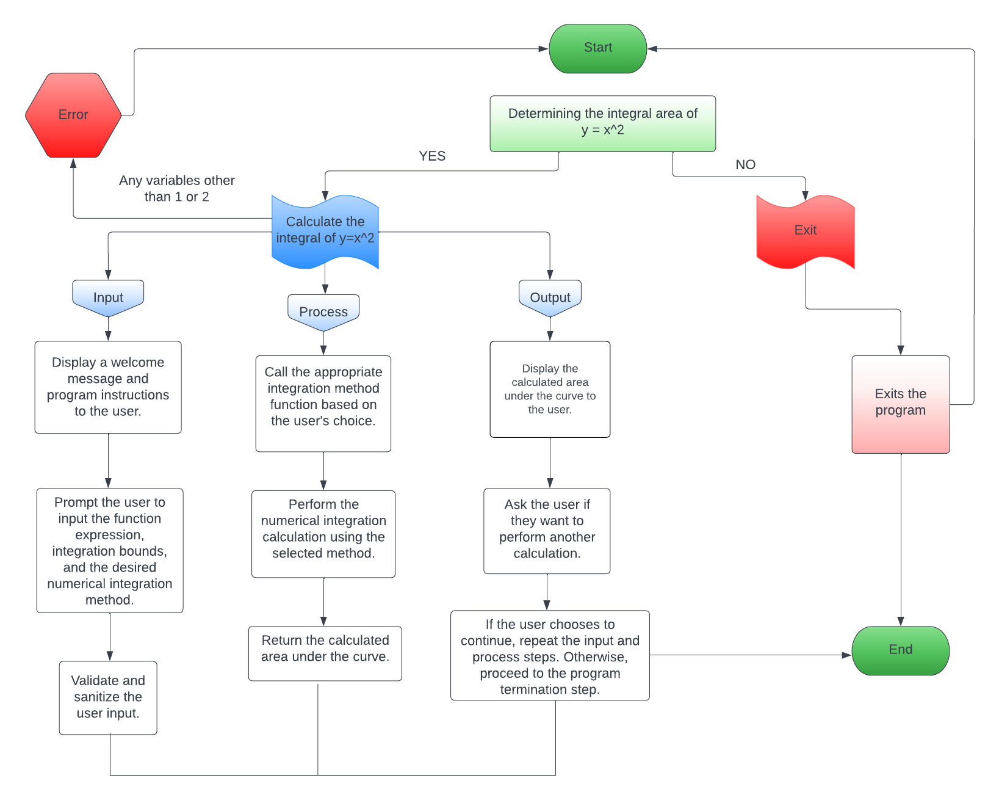

# Welcome to Integral Area Calculator
This C++ program calculates the integral of a function over a given interval using numerical methods. It utilizes the following components:

- **`calculateIntegral`**: A function that calculates the integral using the provided lower bound `a`, upper bound `b`, and the number of intervals `numIntervals`.    
  By integrating `y = f(x)` between the limits of `a` and `b`, we can determine the area under the curve `y = f(x)` between `x = a` and `x = b`.

## Project Structure
- **`.vscode/`**: Contains configuration files for Visual Studio Code to streamline development, debugging, and build tasks.
- **`assets`**: Stores images and other media resources used in the documentation to illustrate concepts and results.
- **`include/`**: Contains header files for declarations.
- **`src/`**: Contains source files with implementations.
- **`lib/`**: For external or custom libraries.
- **`output/`**: Stores output results and examples.
  - **`example_results.txt`**: Contains sample results of the integral calculation.
  - **`program_log.txt`**: Records runtime information and errors.
  - **`graphs/`**: Contains graphical representations, such as `example_graph.png`.
- **`tests/`**: Contains unit tests for the program.

## FlowChart
 

## Questions Of The Integral Area

### What is integral area?

**`Integral Area:`** The integral area refers to the area under a curve obtained by evaluating a definite integral. It represents the total enclosed area between the curve, the x-axis, and the interval of integration. The integral area can be positive or negative depending on the function's behavior within the interval. Integration techniques are used to calculate the integral area, which quantifies quantities such as displacement, value, or change associated with the function or process being modeled.

### Who invented integral area?

The concept of integral area was developed by Sir Isaac Newton and Gottfried Wilhelm Leibniz in the late 17th century.

### What is it used for?

The integral area has various applications, including calculating areas, quantifying physical quantities, solving differential equations, probability and statistics, optimization problems, and applications in physics and engineering. Additionally, it plays a fundamental role in the development of calculus and mathematical analysis.

### Example: Calculating Work

For instance, consider a force `F(x)` applied to an object moving along the `x-axis` from `x = a` to `x = b`. The work done by the force can be calculated using the integral area as follows:  
  

### Rule: Trapezoidal Rule

- The integral area is approximated by dividing the interval `[a, b]` into smaller subintervals, evaluating the function at the endpoints and intermediate points, and summing up the corresponding areas of trapezoids.  
  
- The Trapezoidal Rule provides a numerical approach to estimate integrals when obtaining an exact solution is challenging.  
 

## Graphical Representation

The program includes a graphical representation of the function and the integral area. Here is an example graph:  

The graph displays the function curve in red, and the shaded area represents the integral of the function over the specified interval.

---

Feel free to view the complete research article here: [Overleaf](https://www.overleaf.com/read/wwywpttmwfmx)  
